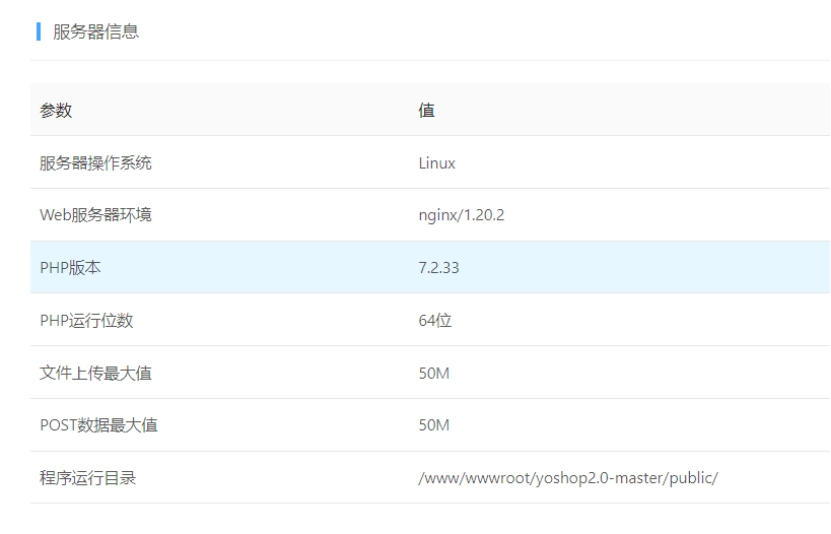
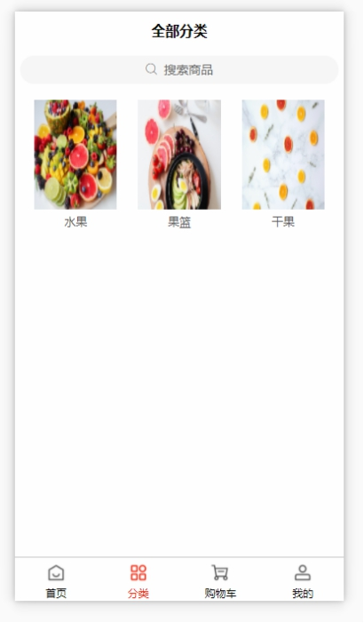
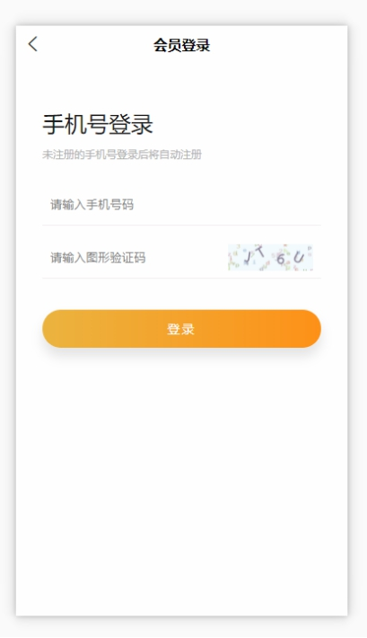

# 一、环境要求

- CentOS 7.0+
-  Nginx 1.10+
- PHP 7.1+ (推荐php7.4)
- MySQL 5.6+

 

# 二、\*******\*如何安装\****

**1、宝塔安装（推荐）**

1. 将后端源码上传至服务器站点，并且将站点运行目录设置为/public
2. 在浏览器中输入站点域名 + /install，例如：http://81.71.32.159/install
3. 将后端源码上传至服务器站点，并且将站点运行目录设置为/public
4. (删除user.ini)
5.  根据页面提示，自动完成安装即可

**2、创建一个数据库**

1. 创建一个数据库，例如：yoshop2_db
2.  导入数据库表结构文件，路径：/public/install/data/install_struct.sql
3. 导入数据库默认数据文件，路径：/public/install/data/install_data.sql
4. 修改数据库连接文件，将数据库用户名密码等信息填写完整，路径/.env

***\*后台地址\****

- 超管后台：http://81.71.32.159/admin
- 商户后台：http://81.71.32.159/store
- 默认的账户密码：admin yinghuo

# 三、页面展示

 

 

 

 

- 用户名和密码：admin yinghuo 